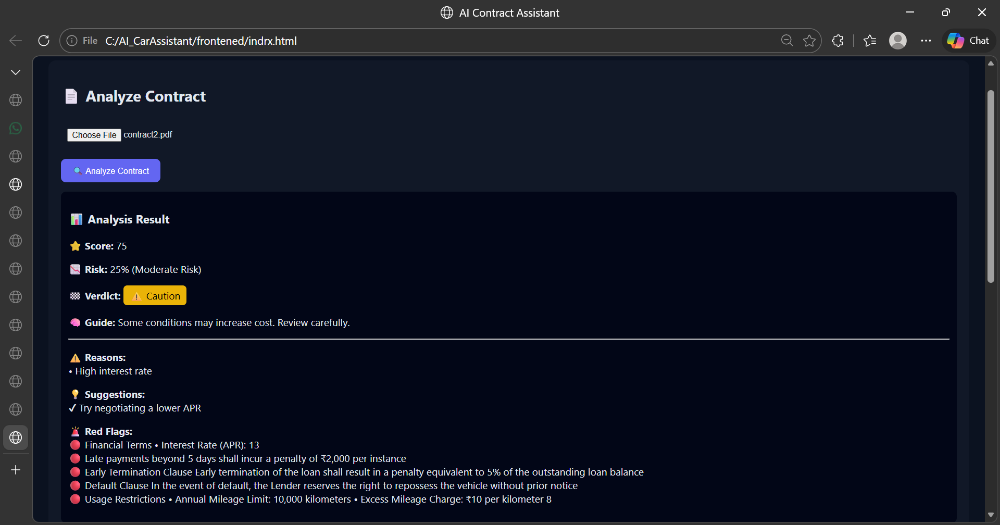
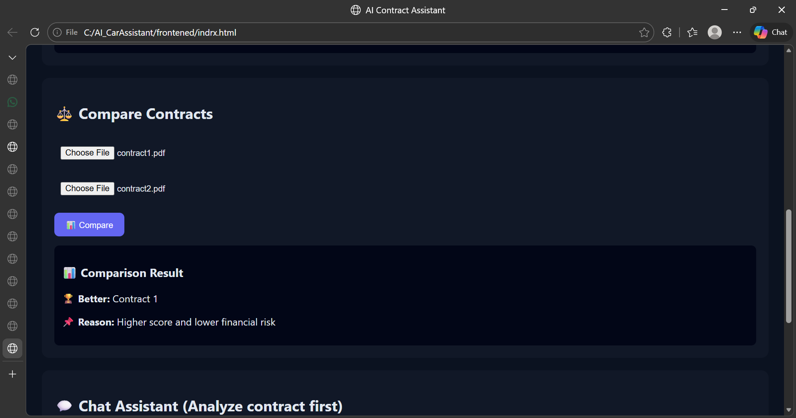
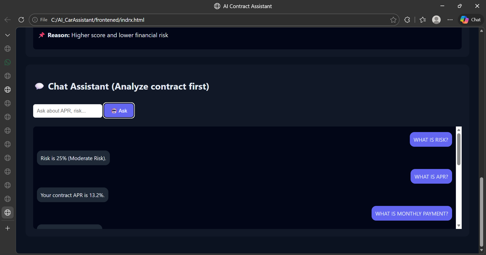
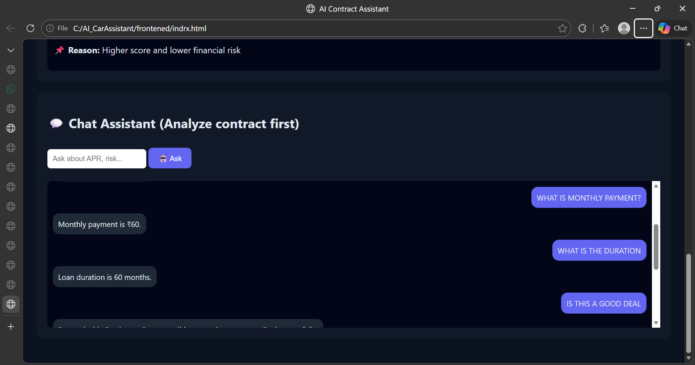
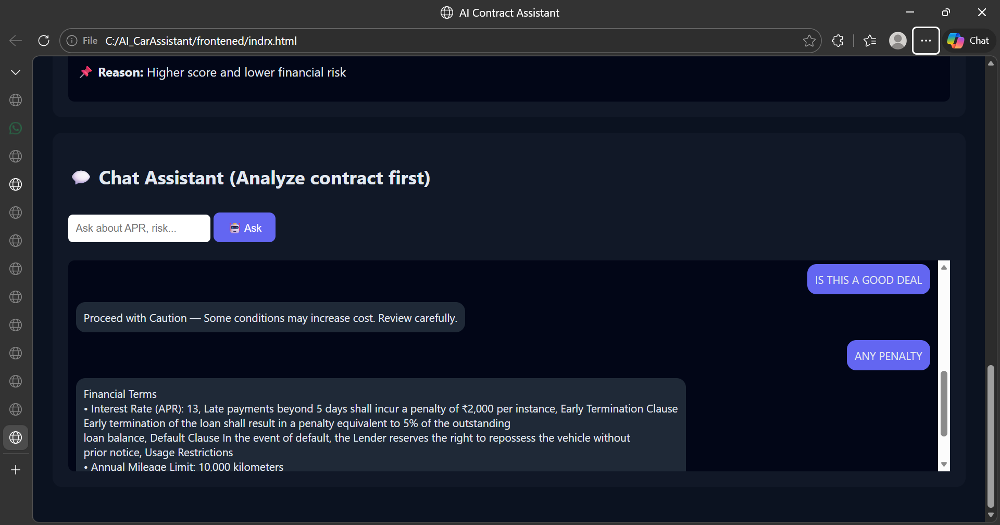
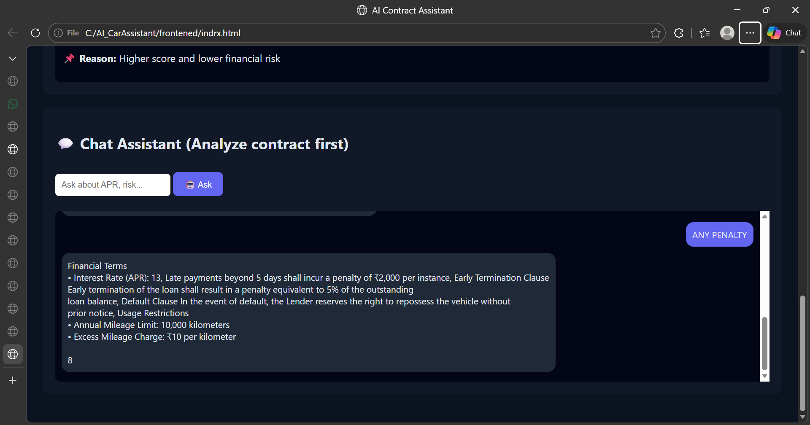

# AI Car Lease / Loan Contract Assistant

## About the Project

Understanding car lease and loan contracts is difficult because they contain complex financial terms and hidden conditions.

This project is a **rule-based intelligent contract analysis system** that simplifies contracts and helps users make informed financial decisions.


## Problem Statement

* Contracts are long and hard to understand
* Important details like APR and penalties are hidden
* Users cannot easily assess financial risk

 This often leads to poor financial decisions


## Solution

The system:

* Extracts key financial data from contracts
* Analyzes financial risk
* Highlights important conditions
* Provides simple and clear explanations


## Core Features

### Contract Analysis

* Upload PDF contract
* Extract:

  * APR (interest rate)
  * Monthly payment
  * Duration
  * VIN number


### Risk Analysis

* Generates contract score (0–100)
* Calculates risk percentage
* Classifies risk level:

  * Low
  * Moderate
  * High


### Decision Support

* Provides final verdict:

  * Good Deal
  * Proceed with Caution
  *  Not Recommended
* Gives reasons and suggestions
* Provides decision guidance


### Contract Comparison

* Compare two contracts
* Selects better option based on:

  * Risk score
  * Financial terms


### Chat Assistant

Users can ask:

* What is the APR?
* What is the risk?
* What is the monthly payment?
* What is the duration?
* Is this a good deal?
* Any penalty?

 The chatbot works using extracted contract data and keyword-based responses.


##  System Workflow

User Upload
↓
PDF Text Extraction (PyPDF2)
↓
Data Extraction (Regex)
↓
Risk Analysis Engine
↓
Insights + Decision Output


## Tech Stack

* **Backend:** Python, FastAPI
* **PDF Processing:** PyPDF2
* **Logic:** Regex + Rule-based system
* **Frontend:** HTML, CSS, JavaScript


## Deployment

### Local Setup

Run backend locally:

```
uvicorn main:app --reload
```

* Backend API: http://127.0.0.1:8000
* Frontend: Open `index.html` in browser
(Note: Can be deployed using platforms like Render, Railway, or Vercel)

###  Live Deployment

####  Backend (Render)

https://ai-carassistant-2.onrender.com

####  Frontend (Vercel)

https://ai-car-assistant-d9bwk6d7c-bhavyadevdebugs-projects.vercel.app


### Important Note

Before deploying frontend, update API URLs in `index.html`:

 Old (local):

```
http://127.0.0.1:8000
```

New (deployed backend):

```
https://ai-carassistant-2.onrender.com
```


### 🔗 Integration

The frontend communicates with the backend using REST API endpoints:
* `/analyze/` → Analyze contract
* `/compare/` → Compare two contracts
* `/chat/` → Chat assistant
  


### 
Deployment is done using forked repositories for hosting purposes. The functionality remains the same as the original project.


## Screenshots / Demo

###  Contract Analysis Output



###  Contract Comparison



### Chat Assistant







##  My Contribution

* Designed complete system architecture and workflow
* Developed FastAPI backend APIs (/analyze, /compare, /chat)
* Implemented PDF text extraction using PyPDF2
* Built data extraction logic using regular expressions
* Designed and implemented risk analysis algorithm
* Developed red flag detection system
* Created frontend UI using HTML, CSS, JavaScript
* Integrated frontend with backend APIs
* Implemented chatbot using keyword-based responses


## Future Improvements

* AI-based contract understanding (LLMs)
* VIN API integration
* Smart dashboards
* User authentication system
* Full web/mobile deployment


##  Conclusion

This project simplifies complex financial contracts, improves transparency, and helps users avoid risky financial decisions.
